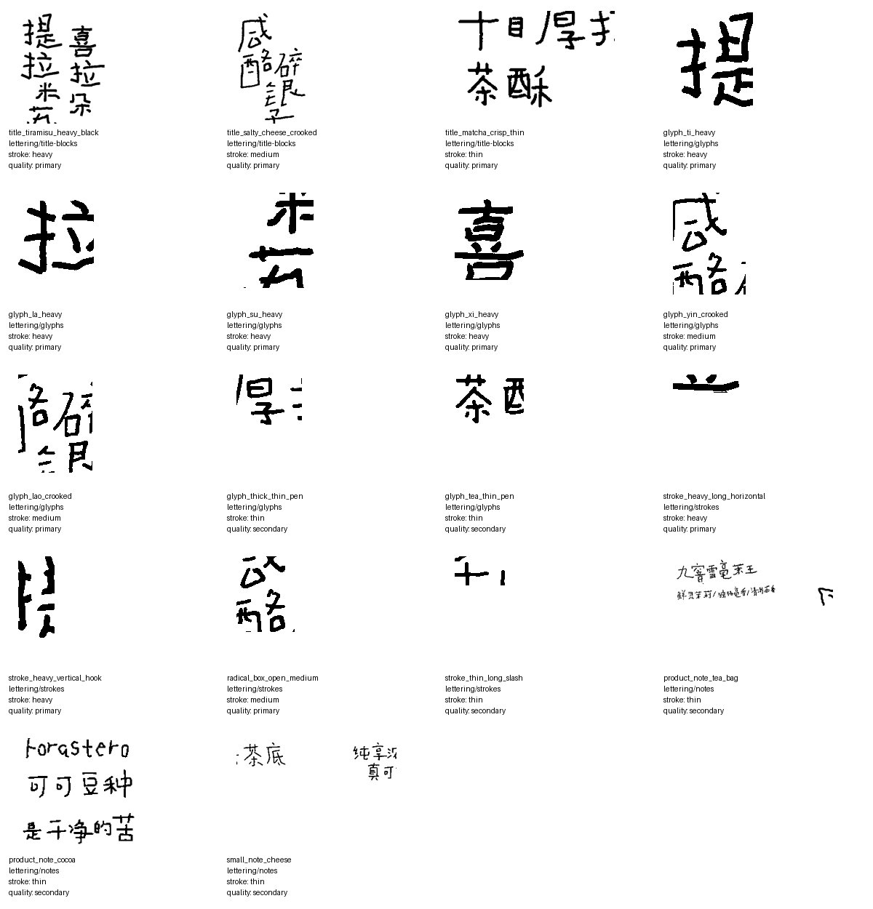
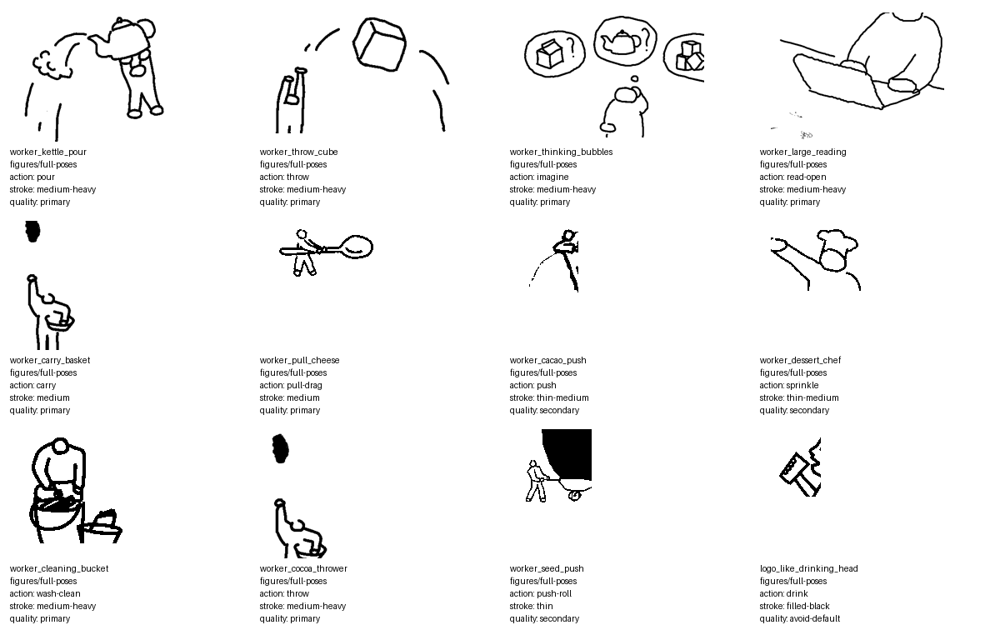
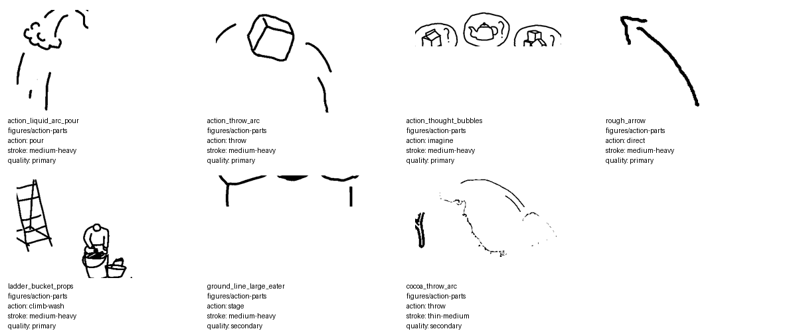

# 喜茶风格儿童简笔画海报 Skill

把一张生活照片做成“真实物件 + 儿童简笔画 + 歪扭手写字”的竖版海报。这个 Skill 的重点不是把整张图转成插画，而是保留一个真实物件作为摄影锚点，再用粗黑、笨拙、带断笔感的小人和中文标题做设计介入。

> 这是一个受喜茶海报语言启发的非官方风格工作流，不是喜茶官方资产生成器。不要生成官方 logo、官方头像、官方包装标识或任何品牌从属声明。

## 能做什么

- 上传一张生活照片，生成可发的竖版海报方向。
- 在生成前区分两套独立模板：
  - `带字版`：字体是第一视觉重点，适合做大标题海报。
  - `无字版`：不出现任何文字，靠小人动作和真实物件讲故事。
  - `两套都出（推荐）`：分别用两套构图生成，不是同一张图删字/加字。
- 对中文字体做单独处理：先生成无字底图，再用参考板和标题层还原“歪歪扭扭的小孩写坏了的字”。
- 使用仓库内的参考 cutouts，辅助模型抓住线条、字形、小人动作和附带道具。

## 风格核心

这个风格由四层组成：

1. **真实物件锚点**：保留照片里的杯子、食物、瓶子、书、钥匙等一个主物件，不把整张图卡通化。
2. **大面积白底留白**：背景干净，物件通常占画面 20%-45%。
3. **粗黑儿童简笔画**：小人像临时涂鸦出来的微型工人，线条有断笔、硬折、坏连接，不是圆滑可爱贴纸。
4. **歪扭中文手写标题**：带字版要控制 glyph 骨架、笔触表面和版式位置，不能只在提示词里写“手写风”。

## 参考资产

仓库包含一组已经抠好的风格参考图：

```text
private-assets/reference-cutouts/
├── asset-index.json
├── contact_sheet_lettering.png
├── contact_sheet_figures.png
├── contact_sheet_action_parts.png
├── lettering/
└── figures/
```

这些参考图用于风格控制，不是官方品牌素材。使用时应把它们当作线条、字形、动作姿态的参考，不要直接复制为最终 logo 或品牌标识。

### 字体参考



### 小人和动作参考





## 使用方式

把本仓库作为 Skill 放到支持 Skill 的 agent 环境里，或直接让 agent 读取 `SKILL.md`。

典型触发语：

```text
把这张照片做成喜茶那种儿童简笔画海报，两套都出。
```

```text
做带字版，标题要像参考里那种歪歪扭扭的小孩写坏了的中文。
```

```text
做无字版，不要任何文字，只靠小人动作和物件关系讲故事。
```

Skill 会先识别照片中的主物件，再选择模板、参考资产、构图方式和修正 prompt。

## 带字版工作流

带字版不要依赖一次性全图生成。推荐三步：

1. **生成海报底图**：保留真实物件，清理背景，留下大标题区，不生成文字。
2. **生成标题参考板**：用 cutouts 建一个 model-facing 参考板，控制字形缺陷和笔画质感。
3. **生成/放置标题层**：单独生成黑色标题层，再合成到海报底图。

生成标题参考板示例：

```bash
python scripts/build_title_reference_sheet.py \
  --title "泰香开饭" \
  --out private-assets/reference-cutouts/title_reference_sheet_taixiang.png \
  --title-ref title_tiramisu_heavy_black \
  --title-ref title_salty_cheese_crooked
```

合成标题层示例：

```bash
python scripts/composite_title_layer.py \
  --base poster-base.png \
  --title title-layer.png \
  --out poster-final.jpg \
  --x 8% \
  --y 7% \
  --width 42%
```

## 无字版工作流

无字版不是“带字版删掉文字”。它需要重新构图：

- 不预留标题区。
- 不生成任何中文、英文、数字、标签或乱码。
- 小人动作更明确，可以倒、推、搬、爬、洗、投、钓、修。
- 道具只服务动作，例如液体弧线、梯子、桶、袋子、箭头、地线、想象泡泡。

## 目录结构

```text
.
├── SKILL.md
├── references/
│   ├── style-guide.md
│   ├── lettering-guide.md
│   └── evaluation.md
├── scripts/
│   ├── build_title_reference_sheet.py
│   └── composite_title_layer.py
├── private-assets/
│   └── reference-cutouts/
└── evals/
    └── evals.json
```

未包含原始截图缓存和私有抽取脚本；仓库只保留已经抠好的参考 cutouts 和可复用工作流。

## 验证

可做的轻量检查：

```bash
python -m json.tool evals/evals.json >/dev/null
python -m py_compile scripts/build_title_reference_sheet.py scripts/composite_title_layer.py
python scripts/build_title_reference_sheet.py \
  --title "泰香开饭" \
  --out /tmp/heytea-title-reference-check.png \
  --title-ref title_tiramisu_heavy_black
```

视觉评估优先看：

- 带字版：字体骨架是否歪扭、粗黑、笨拙、可读。
- 无字版：小人动作和真实物件是否形成完整叙事。
- 两版都要保留真实物件质感、白底留白和粗糙线条，不要变成圆滑卡通贴纸。

## 边界

- 不生成或复刻官方 logo、官方头像、官方包装标识。
- 不把参考 cutouts 当作最终商用品牌素材。
- 如果中文标题生成得像电脑字，应切回“底图 + 标题参考板 + 标题层”的流程，而不是反复重跑整张图。
