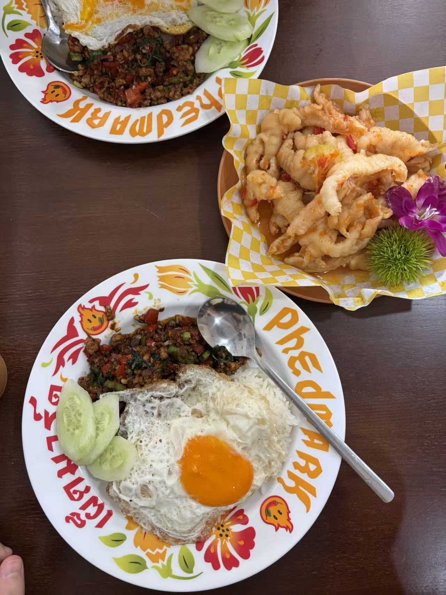
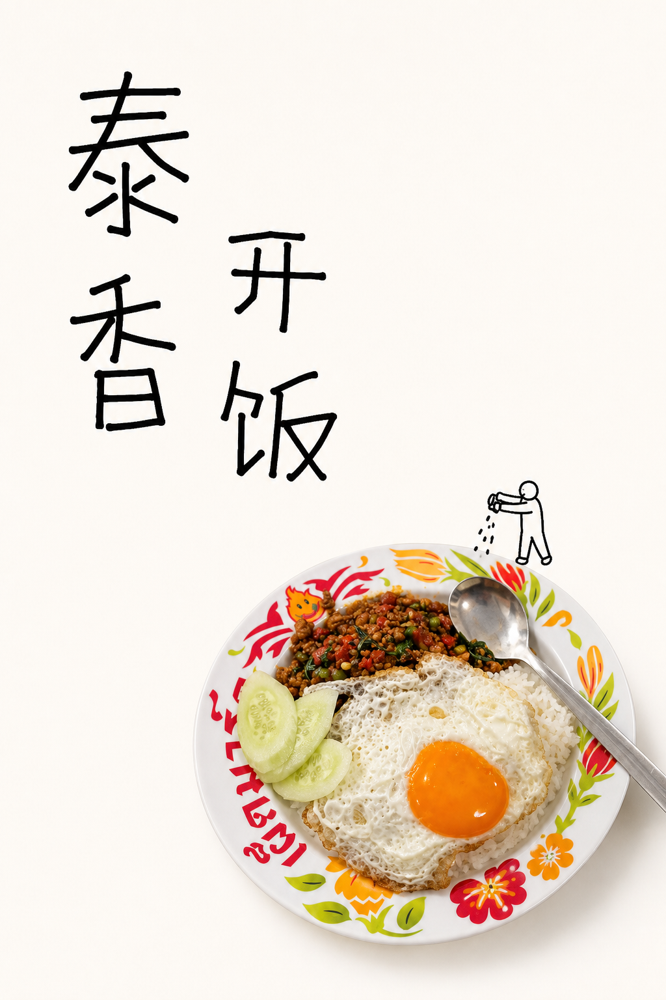
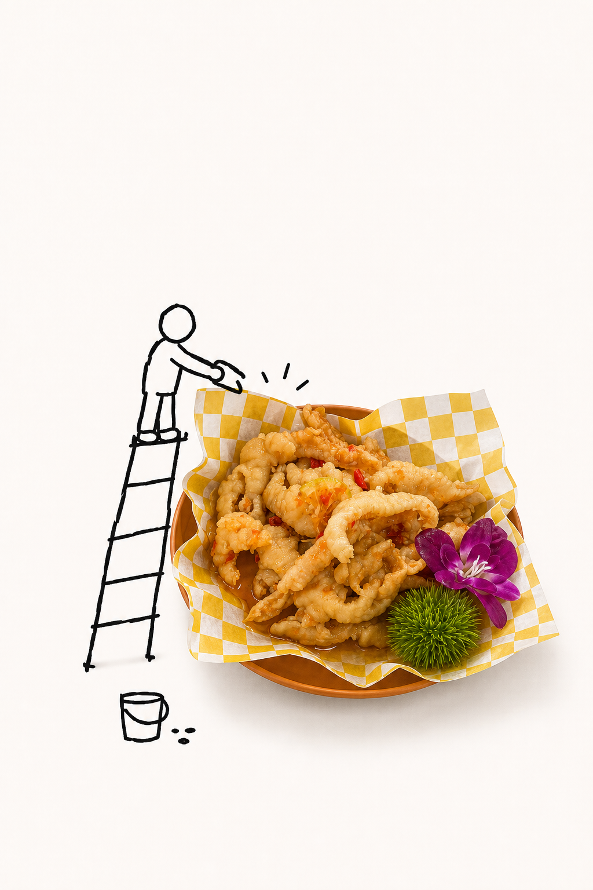
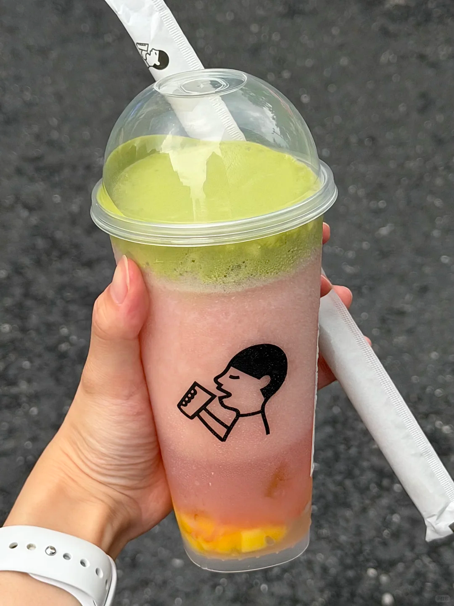
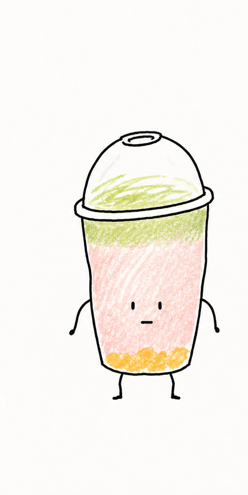
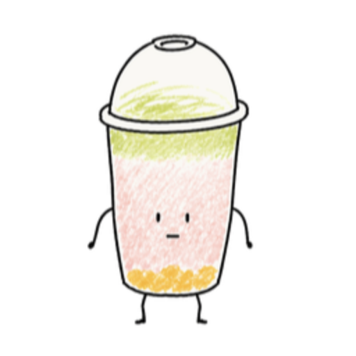
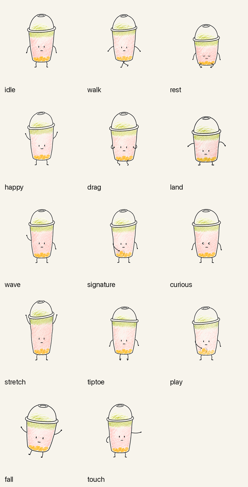

# heytea-style

把一张生活照片变成手绘图文海报，或生成能在 macOS / Windows 桌面运行的手绘桌宠。

> 非官方开源视觉研究与创作工具，与喜茶不存在合作、授权或官方归属关系。

## 效果一：图文海报

同一张照片可以生成两种独立构图。带字版突出歪扭手绘标题；无字版不只是删掉文字，而是改用微型小人的动作讲故事。

| 原始照片 | A. 带字海报 | B. 无字海报 |
|---|---|---|
|  |  |  |

## 效果二：桌宠双分支

同一张饮料照片可以进入两条并列的角色设计路线。选择桌宠模式但没有指定路线时，Skill 会先询问，不会自行决定。

| 原始照片 | A. 写实卡通桌宠 | B. 风味小怪兽桌宠 |
|---|---|---|
|  |  |  |
| 输入提供主体、色彩和材料信息 | 原主体直接成为角色，保留轮廓与关键结构 | 原图提供色彩、配料、材质和动作 DNA，容器不再充当身体 |

### 桌宠会真正动起来

| 动作预览 | 实际桌面尺寸 |
|---|---|
|  |  |

<details>
<summary>展开查看 v2 十二动作审核表</summary>



</details>

## 怎么使用

在 Codex 中上传图片，然后直接描述需要的效果：

```text
把这张照片做成图文海报，两套都出。
把这杯饮料做成写实卡通桌宠。
把这杯饮料做成风味小怪兽桌宠。
```

桌宠制作会经过两次确认：先确认角色形象，再确认动作或行为。只有动作通过后才会导出透明角色包与启动入口。

## 安装 Skill

```bash
git clone https://github.com/Hchen1218/heytea-style.git ~/.codex/skills/heytea-doodle-poster
cd ~/.codex/skills/heytea-doodle-poster
python3 -m pip install -r requirements.txt
```

重新打开 Codex 后即可使用。完整工作边界见 [SKILL.md](SKILL.md)，风格、流程和角色包协议见 [references/](references/)。

## 桌宠运行器

运行器只安装一次，之后每只桌宠通过轻量角色包导入。风味小怪兽使用 schema v3，需要运行器 `3.1.0` 或更高版本。

先进行只读环境预检：

```bash
python3 scripts/check_desktop_pet_environment.py --json --required-schema 3
python3 scripts/install_desktop_pet_runtime.py --json-plan
```

检查安装计划并明确同意后，再执行：

```bash
python3 scripts/install_desktop_pet_runtime.py --yes
```

升级已有运行器需要额外添加 `--upgrade`。工具会保留用户目录中的旧版本备份，不会静默替换系统目录应用、绕过系统安全提示或开启登录自启。

不要直接打开 `assets/desktop-pet-runtime/src/renderer/index.html`；透明置顶、托盘、角色导入和桌面物理依赖 Electron 主进程。

## 两条桌宠产品线

| 能力 | A. 写实卡通 | B. 风味小怪兽 |
|---|---|---|
| 公开格式 | schema v2 | schema v3 |
| 身份设计 | 保留原主体轮廓与关键分区 | 根据风味信息重新设计怪兽 |
| 动作结构 | 固定 12 个动作，可选 `fall` / `touch` | 6–10 个自由行为，支持多阶段 |
| 长行为 | 整段动作循环 | enter / loop / exit 与完成事件 |
| 睡眠 | 普通动作 | 持久睡眠，可被点击或拖拽唤醒 |
| 手势 | 即时点击与拖拽 | 点击和拖拽互斥 |
| 贴地 | 统一角色锚点 | 逐帧贴地，抓取和下落阶段允许悬空 |

两个版本会编译成同一种内部行为模型，共用窗口、物理、托盘和交付链路。已有 v2 角色包无需迁移。

<details>
<summary>构建并校验仓库示例</summary>

写实卡通桌宠：

```bash
python3 scripts/build_desktop_pet_pack.py \
  examples/desktop-pet/pink-green-drink \
  --out generated-pets/pink-green-drink-v2.zip \
  --review-dir generated-pets/pink-green-drink-v2-review

python3 scripts/validate_desktop_pet_pack.py \
  generated-pets/pink-green-drink-v2.zip
```

风味小怪兽桌宠：

```bash
python3 scripts/build_desktop_pet_pack.py \
  examples/desktop-pet/pink-green-flavor-monster-v3 \
  --out generated-pets/pink-green-flavor-monster-v3.zip \
  --review-dir generated-pets/pink-green-flavor-monster-v3-review

python3 scripts/validate_desktop_pet_pack.py \
  generated-pets/pink-green-flavor-monster-v3.zip
```

需要启动/关闭入口时，为构建命令添加 `--delivery-dir <目录>`。

</details>

<details>
<summary>开发、测试与目录结构</summary>

```bash
python3 -m pip install -r requirements-dev.txt
python3 -m json.tool evals/evals.json >/dev/null
python3 -m unittest discover -s tests -v
python3 -m py_compile scripts/*.py

cd assets/desktop-pet-runtime
npm ci
npm test
npm run pack:mac   # macOS
npm run pack:win   # Windows
```

CI 在 macOS 和 Windows 上运行 Python 测试、Electron 单元测试及对应平台构建。

```text
.
├── SKILL.md                         # Skill 入口与权限边界
├── references/                      # 风格、工作流与角色包协议
├── scripts/                         # 构建、校验、交付与环境工具
├── tests/                           # Python 工具测试
├── assets/desktop-pet-runtime/      # Electron 通用运行器
├── assets/examples/                 # README 自制示例
├── examples/desktop-pet/            # 可校验的 v2 / v3 角色包
└── private-assets/reference-cutouts # 研究参考素材
```

本地生成结果、`generated-pets/`、`node_modules/`、`dist/`、用户原始素材、安装后的应用和运行缓存不会进入仓库。

</details>

## 授权与素材边界

- 代码与运行器采用 [MIT License](LICENSE)。
- 仓库自制示例采用 CC BY 4.0；具体范围见 [ASSET-NOTICE.md](ASSET-NOTICE.md)。
- `private-assets/reference-cutouts/` 是第三方视觉研究参考，不属于 CC BY 授权，也不能视为官方素材。
- 用户应确认自己拥有上传图片及生成结果所需的使用权。
- 未获授权时，请勿加入官方 Logo、吉祥物、包装标识或合作声明。
